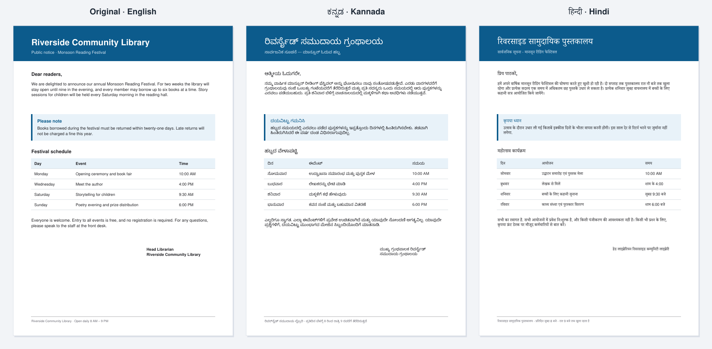
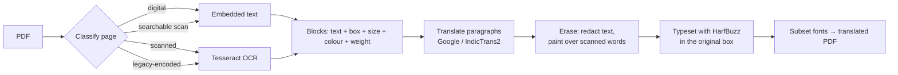

<div align="center">

# PDF Linguist

**Layout-preserving PDF translation, engineered for Indian scripts.**

Translate digital or scanned PDFs into Kannada, Hindi, Tamil, Telugu, Malayalam, Bengali and more.<br>
Every heading, column, table, colour and image stays exactly where it was, and every conjunct renders correctly.

[](https://github.com/NitinReddy-A/PDF_Linguist/actions/workflows/ci.yml)
[](LICENSE)
[](https://www.python.org)
[](https://harfbuzz.github.io)
[](https://pymupdf.readthedocs.io)



<sub>Real output: <a href="examples/sample.pdf"><code>examples/sample.pdf</code></a> translated with the Google engine. Nothing was retouched.</sub>

</div>

---

## Why another PDF translator?

Because for Indian languages, most of them get the hard part wrong.

Indic scripts are not stored the way they are drawn. In Devanagari, **कि** is stored as `क` + `ि`, but the vowel sign is drawn *before* the consonant. In Kannada, **ಕ್ಷ** is three code points (`ಕ` `್` `ಷ`) that must fuse into one conjunct glyph. Reph, below-base forms, split vowels and half-forms all need the font's OpenType rules to be applied by a **text shaping engine**.

Typical PDF pipelines write text with low-level APIs (`insert_text`, FPDF, ReportLab's canvas, ...) that map **one code point to one glyph, left to right**. English survives that. Indian scripts don't:

| What the reader should see | What a naive PDF writer produces |
| :-: | :-: |
| ಕ್ಷೇತ್ರ | ಕ್ ಷ ೇ ತ ್ ರ — detached halant, floating vowel signs |
| कि | क ि — vowel sign on the wrong side |

There are two more Indian-specific traps:

- **Legacy-encoded PDFs.** A huge number of Indian government and education documents were typeset with non-Unicode fonts (*Nudi* and *Baraha* for Kannada, *Kruti Dev* for Hindi). Their text layer extracts as Latin gibberish such as `gÀ²Ã¢Á ¥ÀwæPÉ`, and translators happily translate the gibberish.
- **Scans.** Circulars, notices and textbooks often exist only as scanned images.

PDF Linguist was built around exactly these failure modes.

## The trick: let a browser-grade engine typeset every block

PDF Linguist never places glyphs itself. Each translated paragraph becomes a tiny HTML document that is laid out by **MuPDF's HTML/CSS engine**, which shapes every run of text with **[HarfBuzz](https://harfbuzz.github.io)**, the shaping engine inside Chrome, Firefox and Android:

```python
page.add_redact_annot(block.rect, fill=False)              # 1. delete the original words...
page.apply_redactions(images=PDF_REDACT_IMAGE_NONE,         #    ...but keep images
                      graphics=PDF_REDACT_LINE_ART_NONE)    #    ...and vector art
page.insert_htmlbox(block.layout_rect, html, css=css,      # 2. typeset the translation in the
                    archive=fonts, scale_low=0)             #    same box, HarfBuzz-shaped
```

That one decision gives you:

- **Correct shaping** for every Indic script: conjuncts, matras, reph, ligatures.
- **Right-to-left** layout for Urdu and Arabic.
- **Automatic font fallback** to MuPDF's built-in Noto families for any script, plus a bundled Noto Sans Kannada.
- **Fit-to-box layout.** The translation wraps inside the original bounding box and scales down only if it is longer than the source, so page geometry never shifts.
- **Clean output.** The original text is *deleted*, not hidden under a white box, so search and copy never return the old language.

## How PDF Linguist compares

| | Typical PDF translation script | **PDF Linguist** |
| --- | :-: | :-: |
| Indic conjuncts, matras and reph | ❌ broken glyph order | ✅ HarfBuzz shaping |
| Legacy (Nudi / Baraha / Kruti Dev) text layers | ❌ translates gibberish | ✅ detected, re-read with OCR |
| Scanned PDFs | ⚠️ separate tool | ✅ built-in Tesseract OCR with positions |
| Text position, size, colour, bold/italic | ⚠️ approximate | ✅ per block, from the source |
| Images, tables and vector graphics | ⚠️ often re-drawn or lost | ✅ untouched (redaction-based) |
| Table rows | ❌ merged into one sentence | ✅ each cell translated in place |
| Original text in output | ⚠️ hidden under white boxes | ✅ removed |
| Urdu / Arabic (RTL) | ❌ | ✅ |
| Offline, Indian-language-native model | ❌ | ✅ IndicTrans2 (AI4Bharat) |

## Features

- **One engine for every PDF.** Digital pages use their text layer. Scanned pages, *searchable* scans (an image with an invisible OCR layer) and legacy-encoded pages are detected automatically and handled correctly.
- **Paragraph-level translation.** Lines are re-joined and de-hyphenated before translation, so the translator sees whole sentences, not line fragments. Repeated headers and footers are translated once.
- **Smart box growth.** A short heading's box hugs the English words. PDF Linguist widens each box into free space (never over other text or images) so translations keep their original font size.
- **Two translation engines.** Google Translate (online, no API key, auto-detects the source) or IndicTrans2 (offline, trained specifically on the 22 scheduled Indian languages).
- **Three ways to use it.** A Streamlit web app, a CLI and a Python API.
- **Small output.** Fonts are subset to the glyphs actually used.

## How it works



| Module | Responsibility |
| --- | --- |
| [`languages.py`](pdf_linguist/languages.py) | One registry of languages: translation code, Tesseract model, IndicTrans2 code, script, direction |
| [`encoding.py`](pdf_linguist/encoding.py) | NFC normalisation and legacy-font / broken-text-layer detection |
| [`layout.py`](pdf_linguist/layout.py) | Positioned, styled paragraph blocks; table-cell splitting; box widening |
| [`ocr.py`](pdf_linguist/ocr.py) | Tesseract OCR through PyMuPDF and paper-colour sampling for scans |
| [`translation.py`](pdf_linguist/translation.py) | Google and IndicTrans2 backends, chunking, retries, caching |
| [`render.py`](pdf_linguist/render.py) | Redaction and HarfBuzz-shaped HTML typesetting |
| [`pipeline.py`](pdf_linguist/pipeline.py) | Orchestrates the steps above, page by page, with a report |

## Quick start

```bash
git clone https://github.com/NitinReddy-A/PDF_Linguist.git
cd PDF_Linguist
python -m venv .venv
source .venv/bin/activate          # Windows: .venv\Scripts\activate
pip install -e ".[app]"
```

### Web app

```bash
streamlit run app.py
```

Upload a PDF, choose a language and compare the original and translated pages side by side before downloading.

### Command line

```bash
pdf-linguist examples/sample.pdf --to kn                 # → examples/sample.kn.pdf
pdf-linguist circular.pdf --from kn --to en --pages 1-2  # Kannada scan → English
pdf-linguist report.pdf --to hi --engine indictrans      # offline, Indic-native model
```

Run `pdf-linguist --help` for all options (`--ocr auto|always|never`, `--output`, `--verbose`).

### Python

```python
from pdf_linguist import TranslateOptions, translate_pdf

pdf_bytes, report = translate_pdf("notice.pdf", TranslateOptions(target="ta"))
open("notice.ta.pdf", "wb").write(pdf_bytes)

for page in report.pages:
    print(page.number, page.mode, f"{page.translated}/{page.blocks} paragraphs")
```

Pass your own `translator=` (any object with `translate(texts, source, target) -> list[str]`) to plug in another engine.

## Scanned PDFs

OCR uses [Tesseract](https://github.com/tesseract-ocr/tesseract) with the language packs for the documents you work with:

| OS | Install |
| --- | --- |
| Ubuntu / Debian | `sudo apt install tesseract-ocr tesseract-ocr-kan tesseract-ocr-hin tesseract-ocr-tam` |
| macOS | `brew install tesseract tesseract-lang` |
| Windows | [UB Mannheim installer](https://github.com/UB-Mannheim/tesseract/wiki): tick the Indic languages, then set `TESSDATA_PREFIX` |

For non-English scans, choose the document language (for example `--from kn`) so the right OCR model is used. English is always added, so codes, dates and names inside Indian-language documents are read too.

## Translation engines

| | `google` (default) | `indictrans` |
| --- | --- | --- |
| Runs | Online | Fully offline after first download |
| Languages | All 24 below | English ↔ Indian, Indian ↔ Indian |
| Source detection | Automatic | Choose explicitly |
| Setup | Nothing | `pip install -e ".[indictrans]"`, accept the [model terms](https://huggingface.co/ai4bharat/indictrans2-en-indic-1B) on Hugging Face, `huggingface-cli login` |
| Hardware | Any | GPU recommended (≈1B-parameter models) |

## Supported languages

| Indian languages | | | |
| --- | --- | --- | --- |
| Hindi · हिन्दी `hi` | Kannada · ಕನ್ನಡ `kn` | Tamil · தமிழ் `ta` | Telugu · తెలుగు `te` |
| Malayalam · മലയാളം `ml` | Bengali · বাংলা `bn` | Marathi · मराठी `mr` | Gujarati · ગુજરાતી `gu` |
| Punjabi · ਪੰਜਾਬੀ `pa` | Odia · ଓଡ଼ିଆ `or` | Assamese · অসমীয়া `as` | Nepali · नेपाली `ne` |
| Sanskrit · संस्कृतम् `sa` | Urdu · اردو `ur` | | |

**Plus** English `en`, French `fr`, German `de`, Spanish `es`, Portuguese `pt`, Italian `it`, Russian `ru`, Arabic `ar`, Chinese (Simplified) `zh-CN` and Japanese `ja`.

Adding a language is a one-line entry in [`languages.py`](pdf_linguist/languages.py). To pin a specific typeface for a script, drop a `NotoSans<Script>*.ttf` file into [`pdf_linguist/fonts/`](pdf_linguist/fonts).

## Configuration

Everything works with zero configuration and **no secrets**. Optional settings are read from the environment or from a `.env` file in the working directory (see [`.env.example`](.env.example)):

| Variable | Default | Purpose |
| --- | --- | --- |
| `PDF_LINGUIST_TRANSLATOR` | `google` | Default engine: `google` or `indictrans` |
| `PDF_LINGUIST_OCR_DPI` | `300` | OCR resolution: higher is slower but more accurate |
| `TESSDATA_PREFIX` | auto | Folder containing Tesseract's `*.traineddata` files |

## Docker

The image bundles Tesseract with the major Indian language packs:

```bash
docker build -t pdf-linguist .
docker run -p 8501:8501 pdf-linguist      # open http://localhost:8501
```

## Project structure

```
PDF_Linguist/
├── app.py                  Streamlit web app
├── pdf_linguist/           The engine (importable package + CLI)
│   ├── fonts/              Bundled Noto Sans Kannada (SIL OFL 1.1)
│   └── *.py                languages · encoding · layout · ocr · translation · render · pipeline · cli
├── tests/                  Offline test suite (no network, no API keys)
├── examples/               sample.pdf and the script that generates it
└── docs/images/            README assets
```

## Development

```bash
pip install -e ".[app,dev]"
pytest                       # offline: uses generated PDFs and a fake translator
ruff check . && ruff format --check .
```

See [CONTRIBUTING.md](CONTRIBUTING.md) for how to add languages, fonts and translation engines.

## Known limitations

- **Copy-paste of shaped Indic text.** Pages *look* right, but when HarfBuzz fuses several code points into one conjunct glyph, MuPDF cannot always write a reverse mapping for it, so copying some conjuncts out of the output PDF can return the wrong characters.
- **Bold in fallback fonts.** Headings keep their size and colour, but scripts rendered with MuPDF's built-in fallback fonts may lose bold weight.
- **Vertical and rotated text** inside a page (margin notes, rotated table headers) is left in the original language.
- The Google engine uses Google's public web endpoint and is subject to its rate limits. For large batches, use `indictrans`.

## License

[MIT](LICENSE). The bundled Noto Sans Kannada font is licensed under the [SIL Open Font License 1.1](pdf_linguist/fonts/OFL.txt).

## Acknowledgements

[PyMuPDF / MuPDF](https://pymupdf.readthedocs.io) · [HarfBuzz](https://harfbuzz.github.io) · [Tesseract OCR](https://github.com/tesseract-ocr/tesseract) · [AI4Bharat IndicTrans2](https://github.com/AI4Bharat/IndicTrans2) · [Google Noto Fonts](https://fonts.google.com/noto) · [Streamlit](https://streamlit.io)
